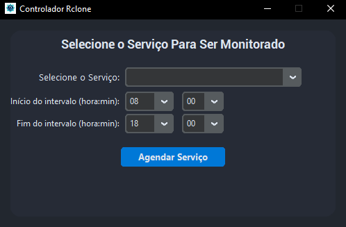

# Agendamento Automático de Serviço Windows

## Descrição
Este projeto é um aplicativo para Windows que permite agendar automaticamente a parada e o início de serviços específicos do Windows, no momento definido apenas para um serviço específico, mas pode ser facilmente adaptado, ideal para serviços de backup corporativo ou rotinas que não devem rodar em horário comercial.
- Desenvolvido em Python
- Não requer instalação de dependências além do Python padrão (ou pode ser empacotado como executável)
- Permite selecionar serviços para gerenciar seu horário de funcionamento no pc.
- Cria, remove e monitora agendamentos no Agendador de Tarefas do Windows

## Funcionalidades
- Agendamento visual: selecione um serviço e defina o intervalo em que ele deve ficar inativo.
- Monitoramento automático: o sistema impede que o serviço seja reiniciado manualmente durante o intervalo.

## Funcionamento
O aplicativo utiliza o Agendador de Tarefas do Windows (`schtasks`):
- Parar o serviço no início do intervalo definido
- Repetidamente garantir que o serviço fique parado no intervalo (caso alguém tente iniciar manualmente)
- Iniciar o serviço automaticamente no fim do intervalo

Todos os agendamentos criados recebem um prefixo para facilitar a identificação e remoção.

## Uso
1. Abra o aplicativo como Administrador.
2. Selecione o serviço desejado.
3. Defina o intervalo de horas em que o serviço deve ficar inativo.
4. Clique em Agendar Serviço.
5. Para remover os agendamentos criados, selecione o serviço e clique em Remover Todos Agendamentos.

EXE disponível para testes !!!
